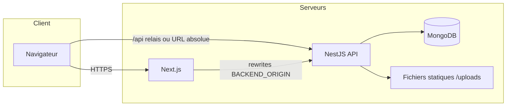
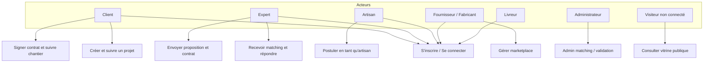
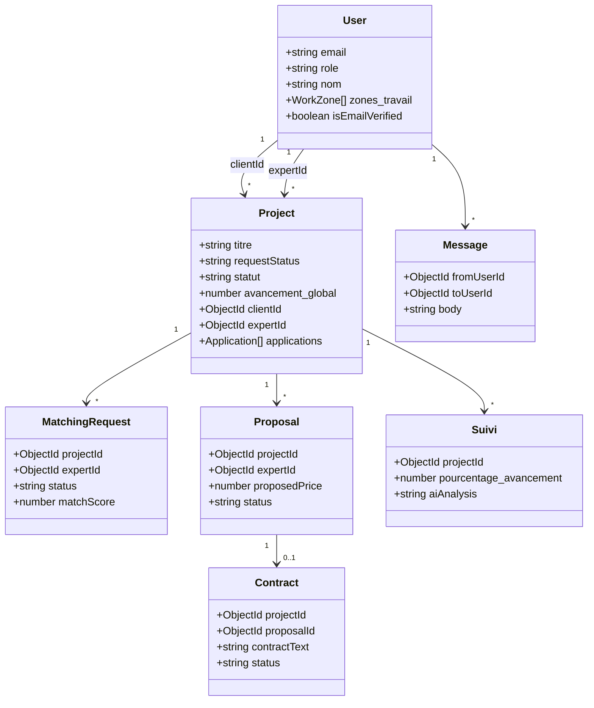
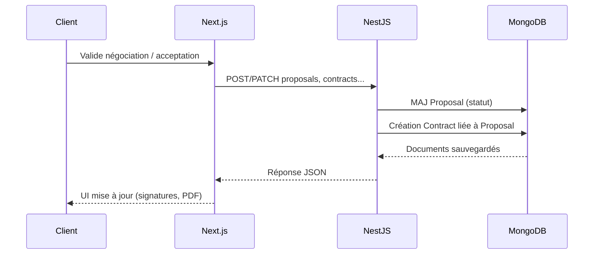

# Rapport technique — BMP.tn (CodeMasters)

**Plateforme digitale BTP** : mise en relation clients, experts, artisans, fabricants / fournisseurs, livreurs et administration ; suivi de chantier, matching, propositions commerciales, contrats, marketplace et messagerie.

*Document généré à partir de l’état du dépôt (backend NestJS, frontend Next.js, MongoDB). Date de rédaction : 4 mai 2026.*

---

## Table des matières

1. [Contexte et objectifs](#1-contexte-et-objectifs)  
2. [Stack technique](#2-stack-technique)  
3. [Architecture logicielle](#3-architecture-logicielle)  
4. [Cas d’utilisation](#4-cas-dutilisation)  
5. [Conception UML (extraits)](#5-conception-uml-extraits)  
6. [Base de données (MongoDB)](#6-base-de-données-mongodb)  
7. [Fonctionnalités développées](#7-fonctionnalités-développées)  
8. [API et communication front / back](#8-api-et-communication-front--back)  
9. [Intégrations transverses](#9-intégrations-transverses)  
10. [Limites et pistes d’évolution](#10-limites-et-pistes-dévolution)

---

## 1. Contexte et objectifs

### 1.1 Problème métier

Le secteur de la construction en Tunisie (et au-delà) nécessite de **centraliser** la demande de travaux, l’**expertise** (études, chiffrage, pilotage), l’**exécution** par des artisans, l’**approvisionnement** matériel et un **suivi** transparent pour le client.

### 1.2 Objectifs du système livré

- Authentifier et **profil** plusieurs types d’utilisateurs (rôles métiers distincts).
- Gérer le **cycle de vie d’un projet** : création, matching expert, propositions, contrat, exécution, clôture, vitrine « avant / après ».
- Assurer le **suivi de chantier** (journal de progression, photos, alertes de retard, analyse IA optionnelle sur photos).
- Proposer une **marketplace** (produits, commandes) et une **messagerie** entre utilisateurs.
- Fournir des **devis** liés aux projets et des **notifications / alertes** métier.

---

## 2. Stack technique

| Couche | Technologies |
|--------|----------------|
| Frontend | **Next.js** 16 (App Router), **React** 19, **TypeScript**, **Tailwind CSS** 4 |
| Backend | **NestJS** 10, **TypeScript**, validation (`class-validator`), **Multer** (uploads) |
| Base de données | **MongoDB** via **Mongoose** 8 |
| E-mail | **Nodemailer** (SMTP, ex. Gmail en développement / production) |
| IA (runtime produit) | **Google Gemini**, **Anthropic**, **Ollama** (selon variables d’environnement) |
| Hébergement local | Backend port **3001**, frontend **3000**, préfixe API globale `/api` |

---

## 3. Architecture logicielle

### 3.1 Vue physique / déploiement (logique)

Le frontend peut appeler l’API en **chemin relatif** `/api` (réécriture vers le backend dans `frontend/next.config.ts`) ou via **`NEXT_PUBLIC_API_URL`** en production.

### 3.2 Découpage backend (modules NestJS)

Les modules importés dans `AppModule` structurent le domaine :

| Module | Responsabilité principale |
|--------|---------------------------|
| `UserModule` | Utilisateurs, inscription (client, expert avec CV, livreur avec pièce d’identité), connexion |
| `AuthModule` | Vérification d’e-mail, analyse de CV (service dédié), routes `/auth/*` |
| `ProjectModule` + `applications` | Projets, candidatures artisans, pièces jointes / photos, workflow `requestStatus` |
| `MatchingModule` | Matching admin → experts, file d’invitations, réponses expert, brouillons d’estimation IA |
| `ProposalsModule` | Propositions prix / délais / notes techniques, contre-propositions client |
| `ContractsModule` | Contrats générés à partir des propositions acceptées, signatures, PDF |
| `SuiviProjectModule` | Ancien module « suivi » classique (liste `/suivi-projects`) |
| `SuiviModule` | Suivi étendu (photos chantier, progression, **analyse IA** sur la même collection MongoDB `suiviprojects`) |
| `AlertsModule` | Alertes de retard / écart de progression, réponses ouvrier |
| `MessagesModule` | Messagerie privée entre utilisateurs |
| `DevisModule` | Devis liés aux projets |
| `MarketplaceModule` | Produits, commandes, items |
| `DashboardModule` | Agrégat projets + utilisateurs (usage type tableau de bord) |

### 3.3 Découpage frontend (Next.js App Router)

- **Point d’entrée** : `/` redirige vers `/espace`.
- **Espaces par rôle** : `/espace/client`, `/espace/expert`, `/espace/artisan`, `/espace/fournisseur`, `/espace/livreur`, `/espace/admin`, etc.
- **Parcours expert** : `/expert/nouveaux-projets`, `/expert/tous-les-projets`, fiches projet, proposition, photos, suivi photo.
- **Parcours client** : nouveau projet, suivi, acceptation / signature, profil.
- **Transversal** : `/login`, `/inscription`, `/messages`, `/contact`, réinitialisation mot de passe, vérification e-mail.

---

## 4. Cas d’utilisation

### 4.1 Diagramme de cas d’utilisation (niveau métier)

### 4.2 Matrice acteurs × fonctionnalités (résumé)

| Acteur | Fonctions clés dans le dépôt |
|--------|------------------------------|
| **Client** | Création projet, suivi, acceptation proposition, signature contrat, notation, messagerie |
| **Expert** | Catalogue matching, réponse aux demandes, proposition commerciale, pilotage projet, photos / suivi, feedback |
| **Artisan** | Candidatures sur projets, gestion chantier, profil |
| **Fournisseur** | Espace dédié, lien avec marketplace |
| **Livreur** | Inscription avec document, zones de livraison |
| **Admin** | Déclenchement matching, liste des demandes (`/admin/matching/*`) |
| **Visiteur** | Pages publiques, réalisations, profils publics |

---

## 5. Conception UML (extraits)

### 5.1 Diagramme de classes — domaine cœur (simplifié)

Les entités suivantes sont matérialisées par des schémas Mongoose ; les relations sont surtout par **références `ObjectId`**.

### 5.2 Diagramme de séquence — schéma du flux « proposition → contrat »

*(Les routes exactes sont réparties entre `proposals`, `contracts` et les pages client sous `espace/client/acceptation`.)*

### 5.3 États du projet (`requestStatus`)

Le schéma `Project` distingue un workflow détaillé, distinct du champ historique `statut` (En attente / En cours / Terminé) :

`draft` → `submitted` → `expert_review` → `proposal_sent` → `negotiation` → `accepted` | `rejected` → `contract_pending_signatures` → `active` → `completed` (ou `cancelled` / `disputed`).

---

## 6. Base de données (MongoDB)

### 6.1 Base et connexion

- URI par défaut : `mongodb://localhost:27017/bmp-tn` si `MONGODB_URI` est absent (`AppModule`).
- Collections déduites des schémas `@Schema` :

| Collection / schéma | Fichier source | Contenu résumé |
|---------------------|----------------|----------------|
| `users` | `user.schema.ts` | Comptes, rôles, compétences, zones, CV expert, CIN livreur, vérification e-mail |
| `projects` | `project.schema.ts` | Projets, workflow, avancement, candidatures artisans, notations, vitrine photos |
| `matchingrequests` | `matching-request.schema.ts` | Invitations expert ↔ projet, score, statut |
| `proposals` | `proposal.schema.ts` | Offres expert, négociation (contre-proposition client) |
| `contracts` | `contract.schema.ts` | Contrat formalisé, signatures, PDF |
| `suiviprojects` | `suivi.schema.ts` / `suivi-project.schema.ts` | Journal de suivi (champs historiques + extensions photo / IA) — **une collection partagée** entre modules legacy et étendu |
| `messages` | `message.schema.ts` | Fil de messages privés |
| `devis` (+ items) | `devis.schema.ts`, `devis-item.schema.ts` | Devis projet |
| `produits`, `commandes`, `commandeitems` | marketplace | Catalogue et commandes |
| `alerts` | `alert.schema.ts` | Alertes de retard |
| `appnotifications` | `app-notification.schema.ts` | Notifications applicatives |
| Devis / commandes | (indexes dans schémas) | Cohérence référentielle par `ref` Mongoose |

### 6.2 Index notables

- `MatchingRequest` : index unique `(projectId, expertId)`.
- `Contract` : index unique sur `projectId` (un contrat principal par projet dans ce modèle).
- `User` : index partiel sur `emailVerificationToken` pour les jetons non nuls.
- `Message` : indexes pour requêtes par couples d’utilisateurs et non lus.

---

## 7. Fonctionnalités développées

### 7.1 Authentification et comptes

- Inscription **client** standard ; **expert** avec upload **CV** (PDF/DOCX) ; **livreur** avec **CIN / permis**.
- Connexion, réinitialisation mot de passe, **vérification d’adresse e-mail** (jetons en base, mails via Nodemailer).
- Profils publics (`/profil/[id]`), réalisations (`/realisations/[id]`).

### 7.2 Projets et matching

- Création de projet riche (localisation, budget, urgence, pièces jointes, photos du site).
- **Matching** : déclenchement côté admin, demandes adressées aux experts, réponse (acceptation / refus), catalogues expert.
- Estimation / brouillon de proposition assistée par **services IA** côté matching (voir code `projectEstimateService`).

### 7.3 Propositions, contrats, devis

- Proposition commerciale (prix, durée, notes techniques, suggestions matériaux).
- **Contre-proposition** client ; révision par l’expert.
- Génération de **contrat** lié à la proposition acceptée ; **signatures** et dépôt de **PDF** signés.
- Module **devis** (montant, statut, lignes d’items).

### 7.4 Suivi de chantier et alertes

- Entrées de suivi avec pourcentage, coût, photos ; module **suivi photo** expert avec possibilité d’**analyse textuelle IA** stockée (`aiAnalysis`).
- **Alertes** lorsque la progression réelle est en retard vs prévision (avec réponse possible de l’ouvrier).

### 7.5 Marketplace

- CRUD produits (vendeur), commandes et lignes de commande, statuts.

### 7.6 Messagerie

- Conversations entre utilisateurs ; compteur de non lus côté API.

### 7.7 Administration

- Routes `admin/matching/*` pour piloter le matching et consulter les demandes.

---

## 8. API et communication front / back

- Préfixe global NestJS : **`/api`** (`main.ts`).
- Le frontend utilise `getApiBaseUrl()` : par défaut **`/api`** (même origine + rewrites) ou **`NEXT_PUBLIC_API_URL`** pointant vers `https://.../api`.
- Plusieurs routes métier s’appuient sur l’en-tête **`x-user-id`** pour identifier l’utilisateur connecté (modèle **session / trust côté client** à durcir en production avec JWT ou cookies httpOnly).

### 8.1 Cartographie des contrôleurs (préfixes après `/api`)

| Préfixe contrôleur | Exemples de ressources |
|--------------------|-------------------------|
| `/users` | CRUD utilisateurs, login, profils publics |
| `/auth` | Vérification e-mail, analyse CV |
| `/projects` | Projets, uploads, expert, artisan, vitrine |
| `/applications` | Candidatures artisans |
| `/matching/...` | File d’attente expert, réponses, catalogues |
| `/proposals` | Propositions et négociation |
| `/contracts` | Contrats et signatures |
| `/suivi-projects` | Suivi classique |
| `/suivi` | Suivi étendu (photos, IA) |
| `/alerts` | Alertes |
| `/notifications` | Notifications |
| `/messages` | Messagerie |
| `/devis` | Devis |
| `/marketplace` | Produits et commandes |
| `/dashboard` | Agrégation projets / utilisateurs |

---

## 9. Intégrations transverses

- **E-mails transactionnels** : confirmation d’inscription, liens magiques (variables `MAIL_*`, `FRONTEND_URL`).
- **Fichiers uploadés** : servis sous **`/uploads/...`** depuis `public/uploads` côté backend.
- **IA** :
  - **Gemini / Anthropic** : analyse de CV à l’inscription expert, compléments dans le module auth.
  - **Ollama / Anthropic** : suivi photo et estimation matching selon configuration (voir `backend/.env.example`).
- **CORS** : actuellement paramétré pour des origines **localhost** ; à étendre aux domaines de production pour un déploiement public.

---

## 10. Limites et pistes d’évolution

| Sujet | Constat | Piste |
|-------|---------|--------|
| Sécurité | Identification souvent via `x-user-id` | Introduire **JWT** ou session serveur, RBAC middleware |
| CORS | Origines fixes développement | Variables d’environnement pour domaines prod |
| Tests | Présence de Jest côté Nest | Couverture API et parcours critiques |
| Stockage fichiers | Disque local | Object storage (S3, GridFS) en production |
| Documentation OpenAPI | Non centralisée dans ce rapport | Swagger `@nestjs/swagger` |

---

## Annexes

### A. Références de fichiers clés

- Backend : `backend/src/app.module.ts`, `backend/src/main.ts`
- Frontend : `frontend/src/lib/api-base.ts`, `frontend/next.config.ts`
- Schémas : `backend/src/*/schemas/*.schema.ts`

### B. Nom du projet dans le monorepo

- Package racine : `bmp-tn-monorepo` (`package.json`).

---

*Fin du rapport technique.*
